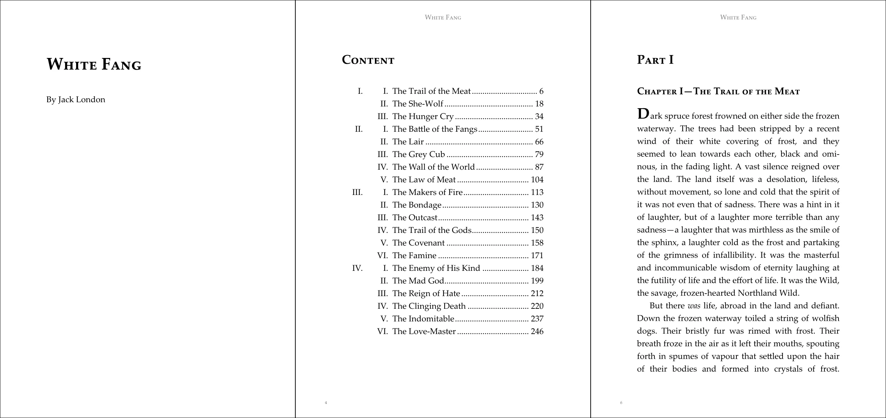
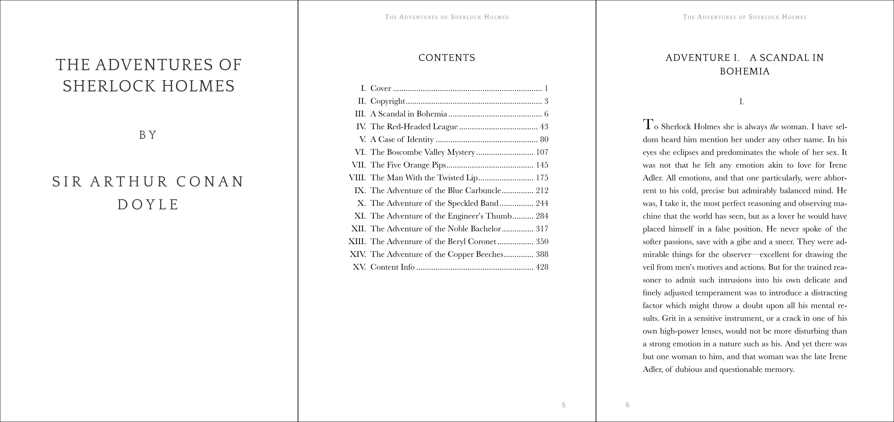

# Vivliostyle Themesギャラリー

npm packageとして公開されているVivliostyle Themesのギャラリーです。新しく公開されたテーマは見つけ次第掲載していますが、掲載漏れを見つけた場合は [issue](https://github.com/vivliostyle/themes/issues) やpull requestをお願いします。

## 公式のVivliostyle Themes

現在、6つの公式のテーマがあります。

### [@vivliostyle/theme-bunko](https://www.npmjs.com/package/@vivliostyle/theme-bunko)

日本語の縦書き小説などに向いています。ルビ、縦中横にも対応しています。CSS変数で行数・文字数、ページヘッダ等をカスタマイズ可能です。

- [README（CSS変数一覧）](https://github.com/vivliostyle/themes/tree/main/packages/@vivliostyle/theme-bunko#readme)

### [@vivliostyle/theme-slide](https://www.npmjs.com/package/@vivliostyle/theme-slide)

スライド資料などに向いています。表紙ページと一般ページでスタイルが変わります。CSS変数で配色、レイアウト、カバーページのスタイル等をカスタマイズ可能です。

- [README（CSS変数一覧）](https://github.com/vivliostyle/themes/tree/main/packages/@vivliostyle/theme-slide#readme)

### [@vivliostyle/theme-techbook](https://www.npmjs.com/package/@vivliostyle/theme-techbook)

印刷を意識した技術書（小口・ノドの余白調整など）。ソースコードや目次にも対応しています。CSS変数で配色、ページヘッダ・フッタ、画像解像度等をカスタマイズ可能です。

- [README（CSS変数一覧）](https://github.com/vivliostyle/themes/tree/main/packages/@vivliostyle/theme-techbook#readme)

### [@vivliostyle/theme-academic](https://www.npmjs.com/package/@vivliostyle/theme-academic)

学生が書くレポートなどに向いています。自動で章・節番号がつきます。CSS変数で図のサイズやフレーム要素のスタイルをカスタマイズ可能です。

- [README（CSS変数一覧）](https://github.com/vivliostyle/themes/tree/main/packages/@vivliostyle/theme-academic#readme)

### [@vivliostyle/theme-gutenberg](https://www.npmjs.com/package/@vivliostyle/theme-gutenberg)

英語の横書き小説などに向いています。デフォルトの `theme.css` のほかに、3種のCSSバリエーション（`alice.css`, `fang.css`, `sherlock.css`）があります。

- [README](https://github.com/vivliostyle/themes/tree/main/packages/@vivliostyle/theme-gutenberg#readme)

#### alice.css

#### fang.css

#### sherlock.css

### [@vivliostyle/theme-epub3j](https://www.npmjs.com/package/@vivliostyle/theme-epub3j)

[電書協EPUB3制作ガイド](http://ebpaj.jp/counsel/guide)準拠のEPUBを作るためのテーマです。日本語縦書きのEPUB出版物に適しています。

- [README](https://github.com/vivliostyle/themes/tree/main/packages/@vivliostyle/theme-epub3j#readme)

## 非公式のVivliostyle Themes

### [vivliostyle-theme-dnd-5e-phb](https://www.npmjs.com/package/vivliostyle-theme-dnd-5e-phb)

作成者：oldgeese

D&D 5e PHB theme for Vivliostyle

### [vivliostyle-theme-thesis](https://www.npmjs.com/package/vivliostyle-theme-thesis)

作成者：yamasy1549

Academic theme (thesis)

### [vivliostyle-akashi-kosen-bulletin](https://www.npmjs.com/package/vivliostyle-akashi-kosen-bulletin)

作成者：yamasy1549

明石高専の年報用スタイル（非公式）
