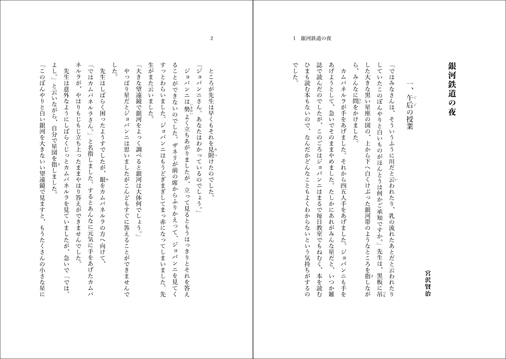
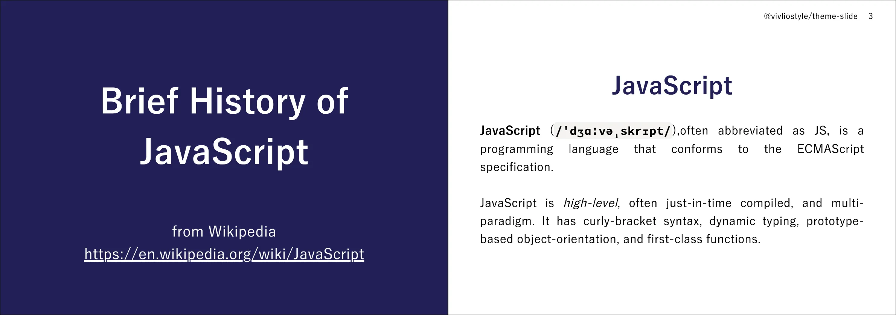
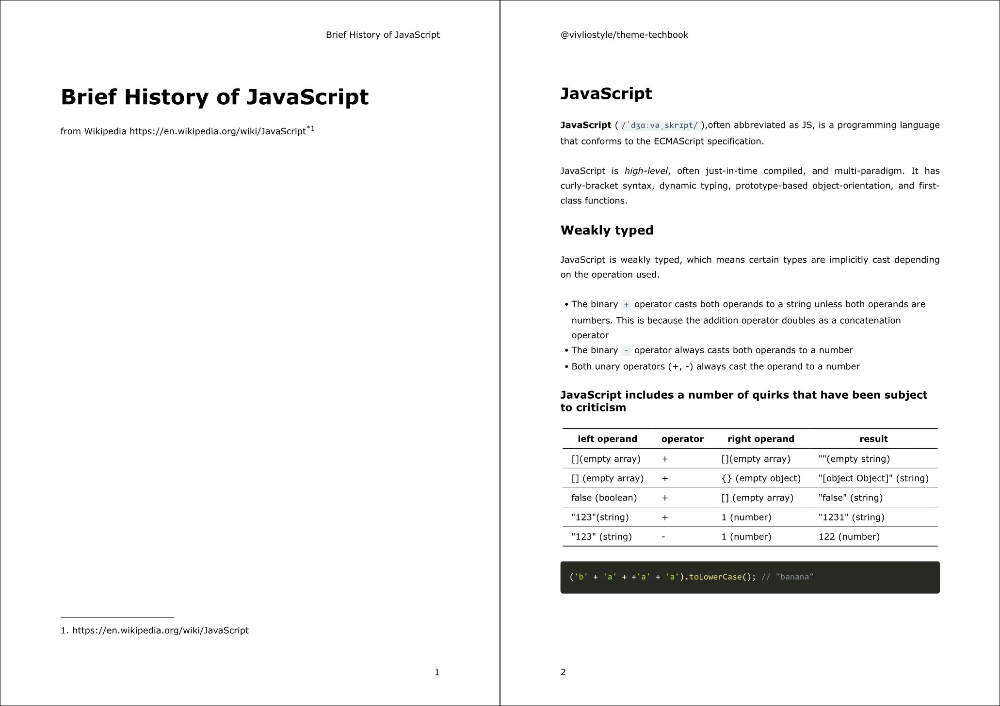
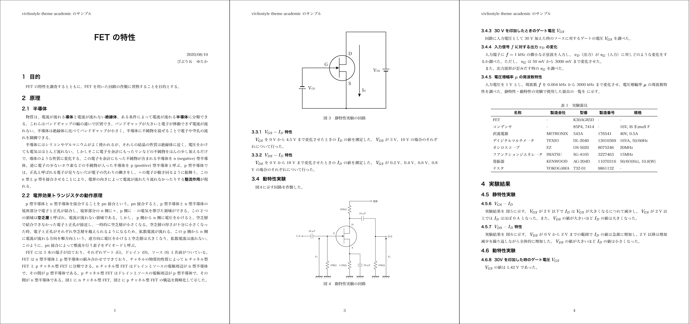
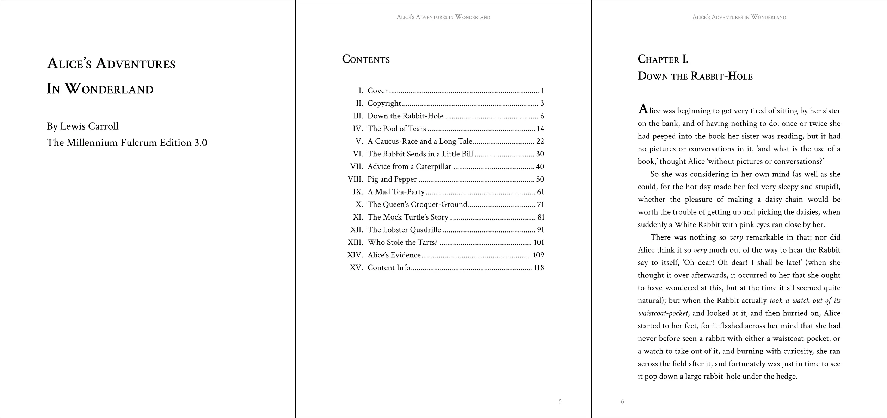
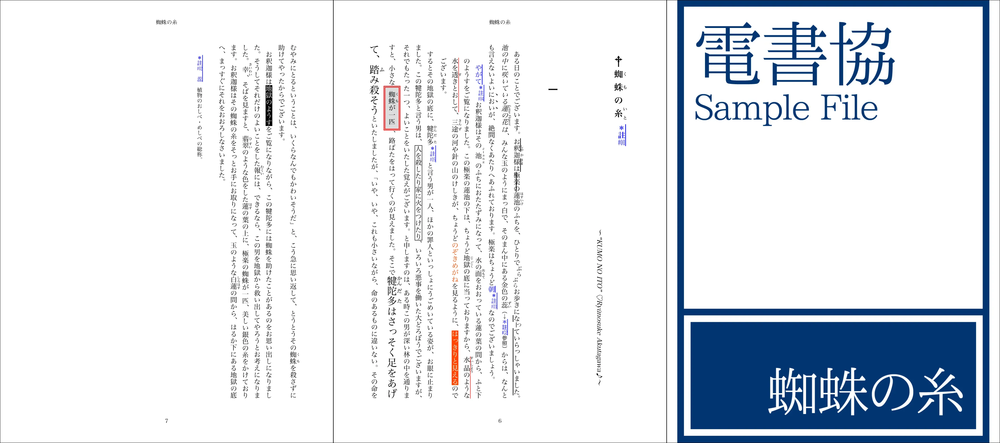
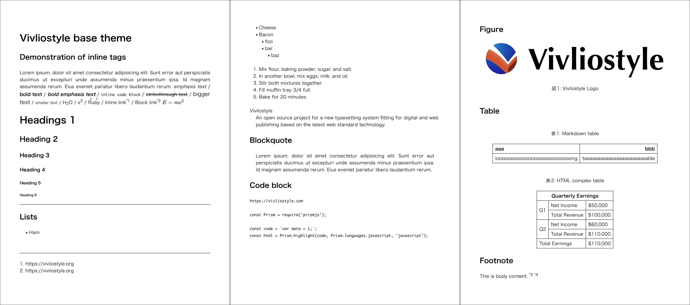

# テーマの使い方

Vivliostyle Themeは、Vivliostyleで出版物を作る際に使うスタイルテーマです。npmパッケージとして配布されており、`vivliostyle.config.js` で指定するだけで出版物のスタイルを適用できます。

## テーマのインストール

使いたいテーマをnpmでインストールします。

```bash
npm install @vivliostyle/theme-techbook
```

## テーマの指定方法

### 基本的な指定

`vivliostyle.config.js` の `theme` プロパティにパッケージ名を指定します。

```js
module.exports = {
  theme: '@vivliostyle/theme-techbook',
};
```

### 特定のCSSファイルを指定する

テーマによっては複数のCSSファイルを提供しています。デフォルト以外のCSSファイルを使う場合は、`specifier` と `import` を指定します。

```js
module.exports = {
  theme: {
    specifier: '@vivliostyle/theme-gutenberg',
    import: 'alice.css',
  },
};
```

### 複数テーマの組み合わせ

`theme` プロパティに配列を指定することで、複数のテーマを組み合わせられます。たとえば、テーマのコードブロック配色を変更する場合:

```js
module.exports = {
  theme: [
    '@vivliostyle/theme-techbook',
    {
      specifier: '@vivliostyle/theme-base',
      import: 'css/lib/prism/theme-prism.css',
    },
  ],
};
```

## CSS変数によるカスタマイズ

各テーマはCSSカスタムプロパティ（CSS変数）で設定値を公開しています。カスタムCSSファイルで変数を上書きすることで、テーマのスタイルを調整できます。

### CSS変数の命名規則

| プレフィックス | 用途 | 例 |
|---|---|---|
| `--vs-` | ドキュメント全体に影響するメタプロパティ | `--vs-font-family`, `--vs-font-size` |
| `--vs--` | 基本HTMLタグのスタイル | `--vs--heading-line-height`, `--vs--h1-font-size` |
| `--vs-{module}--` | モジュール固有の設定 | `--vs-crossref--counter-style`, `--vs-toc--marker-margin-inline` |
| `--vs-theme--` | テーマ固有の設定 | `--vs-theme--anchor-color-body`, `--vs-theme--page-bottom-content` |

### カスタマイズの例

テーマのCSS変数を上書きするカスタムCSSを作成し、`vivliostyle.config.js` で追加指定します。

**custom.css:**

```css
:root {
  --vs-theme--anchor-color-body: #e74c3c;
  --vs-theme--page-top-left-content: 'My Book Title';
  --vs-theme--page-bottom-content: counter(page);
}
```

**vivliostyle.config.js:**

```js
module.exports = {
  theme: [
    '@vivliostyle/theme-techbook',
    'custom.css',
  ],
};
```

各テーマで利用可能なCSS変数の一覧は、テーマごとのREADMEを参照してください。

## 公式テーマ一覧

### [@vivliostyle/theme-bunko](https://github.com/vivliostyle/themes/tree/main/packages/@vivliostyle/theme-bunko)

文庫（縦書き小説）向け。ルビ・縦中横対応、行数・文字数の設定可能。



### [@vivliostyle/theme-slide](https://github.com/vivliostyle/themes/tree/main/packages/@vivliostyle/theme-slide)

スライドプレゼンテーション向け。カバーページ（`.cover`）、全面画像ページ対応。



### [@vivliostyle/theme-techbook](https://github.com/vivliostyle/themes/tree/main/packages/@vivliostyle/theme-techbook)

技術同人誌向け。余白調整、目次、ソースコードハイライト対応。



### [@vivliostyle/theme-academic](https://github.com/vivliostyle/themes/tree/main/packages/@vivliostyle/theme-academic)

レポート・学術論文向け。章・節の自動採番、フレーム要素（`.frame`）対応。



### [@vivliostyle/theme-gutenberg](https://github.com/vivliostyle/themes/tree/main/packages/@vivliostyle/theme-gutenberg)

英文書籍向け。3種のCSSバリエーション（`alice.css`, `fang.css`, `sherlock.css`）あり。



### [@vivliostyle/theme-epub3j](https://github.com/vivliostyle/themes/tree/main/packages/@vivliostyle/theme-epub3j)

日本語EPUB3出版物向け。電書協EPUB3制作ガイド準拠のスタイル。



### [@vivliostyle/theme-base](https://github.com/vivliostyle/themes/tree/main/packages/@vivliostyle/theme-base)

他テーマの基盤となるCSSツールキット。モジュール単位で `@import` 可能。



各テーマの詳細は [Vivliostyle Themesギャラリー](./gallery.md) を参照してください。

## theme-baseを直接使う

[@vivliostyle/theme-base](https://github.com/vivliostyle/themes/tree/main/packages/@vivliostyle/theme-base) は、他のテーマの基盤となるベーステーマです。独自テーマを構築する際のツールキットとしても利用できます。

### プリセット

| プリセット | 内容 |
|---|---|
| `theme-all.css` | 全モジュールを含む（相互参照、脚注、ページレイアウト、目次等） |
| `theme-basic.css` | 基本モジュールのみ（CSSリセット、基本スタイル） |

```js
// theme-all.css を使用
module.exports = {
  theme: {
    specifier: '@vivliostyle/theme-base',
    import: 'theme-all.css',
  },
};
```

### 利用可能なモジュール

| モジュール | theme-all.css | theme-basic.css | CSS変数プレフィックス |
|---|:---:|:---:|---|
| Basic（基本スタイル） | ✅ | ✅ | `--vs-`, `--vs--` |
| Cross-reference（相互参照） | ✅ | - | `--vs-crossref--` |
| Endnotes（後注） | ✅ | - | `--vs-endnote--` |
| Footnotes（脚注） | ✅ | - | `--vs-footnote--` |
| Page layout（ページレイアウト） | ✅ | - | `--vs-page--` |
| Section references（節参照） | ✅ | - | `--vs-section--` |
| Table of Contents（目次） | ✅ | - | `--vs-toc--` |
| Utility classes | ✅ | - | — |
| Prism（コードハイライト） | - | - | `--vs-prism--` |

CSSでの個別インポート例:

```css
@import url("../@vivliostyle/theme-base/css/common/meta-properties.css");
@import url("../@vivliostyle/theme-base/css/common/reset.css");
@import url("../@vivliostyle/theme-base/css/common/basic.css");
@import url("../@vivliostyle/theme-base/css/partial/toc.css");
@import url("../@vivliostyle/theme-base/css/partial/footnote.css");
```

各モジュールのCSS変数の詳細は、[theme-baseのREADME](https://github.com/vivliostyle/themes/tree/main/packages/@vivliostyle/theme-base#available-modules-and-css-variables) を参照してください。
