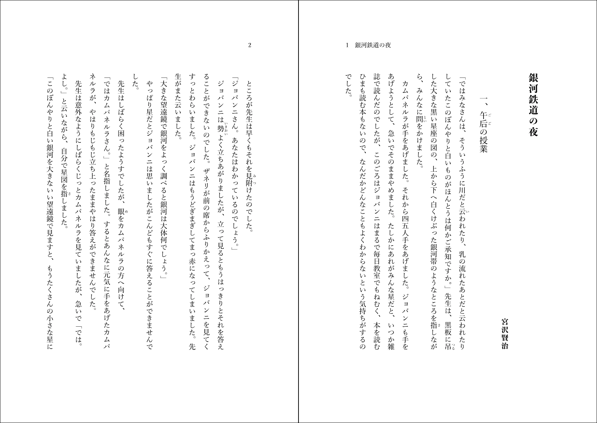
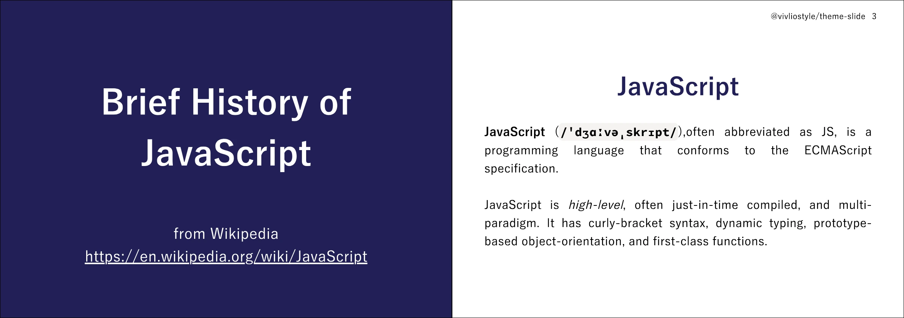
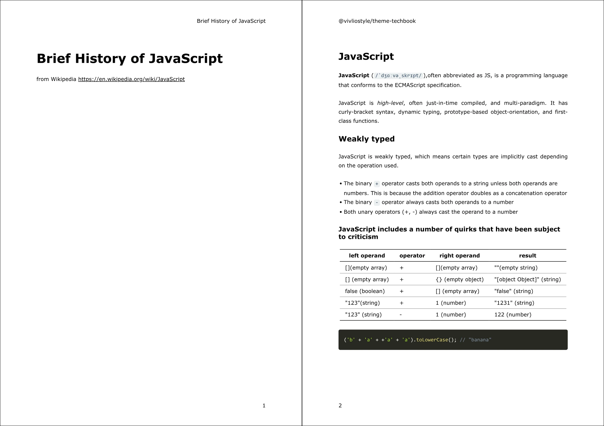
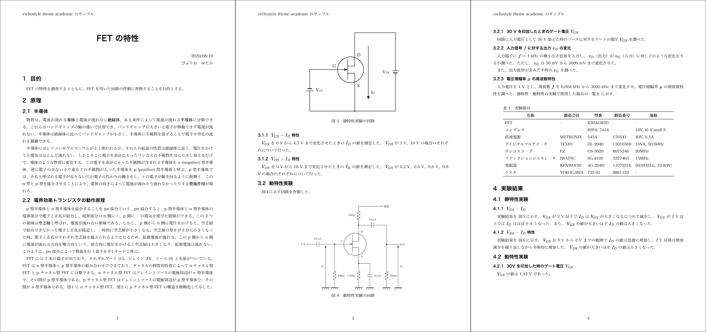
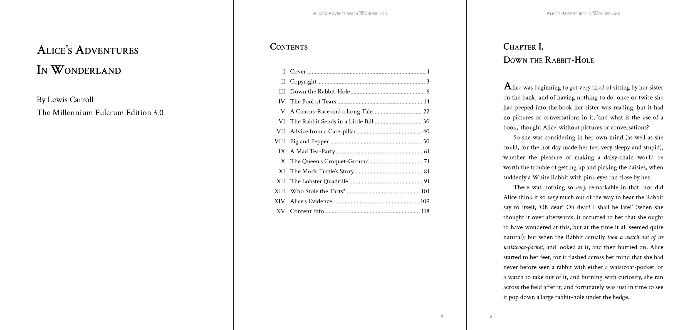
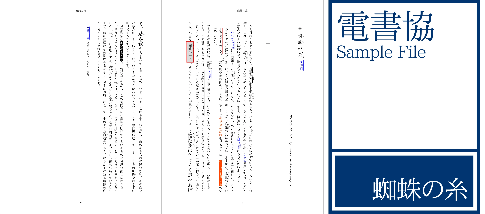
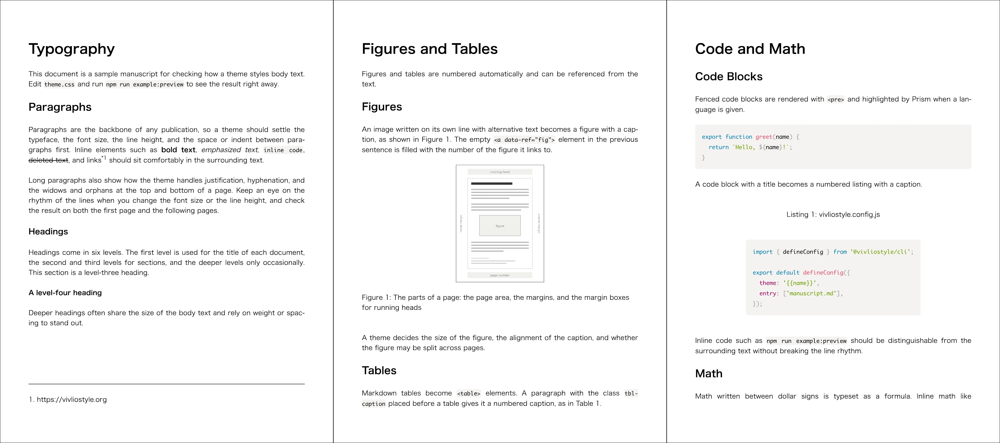

# テーマの使い方

Vivliostyle Themeは、Vivliostyleで出版物を作る際に使うスタイルテーマです。npmパッケージとして配布されており、`vivliostyle.config.js` で指定するだけで出版物のスタイルを適用できます。

## テーマのインストール

使いたいテーマをnpmでインストールします。

```bash
npm install @vivliostyle/theme-techbook
```

## テーマの指定方法

### 基本的な指定

`vivliostyle.config.js` の `theme` プロパティにパッケージ名を指定します。

```js
module.exports = {
  theme: '@vivliostyle/theme-techbook',
};
```

### 特定のCSSファイルを指定する

テーマによっては複数のCSSファイルを提供しています。デフォルト以外のCSSファイルを使う場合は、`specifier` と `import` を指定します。

```js
module.exports = {
  theme: {
    specifier: '@vivliostyle/theme-gutenberg',
    import: 'alice.css',
  },
};
```

### 複数テーマの組み合わせ

`theme` プロパティに配列を指定することで、複数のテーマを組み合わせられます。たとえば、テーマのコードブロック配色を変更する場合:

```js
module.exports = {
  theme: [
    '@vivliostyle/theme-techbook',
    {
      specifier: '@vivliostyle/theme-base',
      import: 'prism/theme-prism',
    },
  ],
};
```

## CSS変数によるカスタマイズ

各テーマはCSSカスタムプロパティ（CSS変数）で設定値を公開しています。カスタムCSSファイルで変数を上書きすることで、テーマのスタイルを調整できます。

### CSS変数の命名規則

| プレフィックス    | 用途                                     | 例                                                                 |
| ----------------- | ---------------------------------------- | ------------------------------------------------------------------ |
| `--vs-`           | ドキュメント全体に影響するメタプロパティ | `--vs-font-family`, `--vs-font-size`                               |
| `--vs--`          | 基本HTMLタグのスタイル                   | `--vs--heading-line-height`, `--vs--h1-font-size`                  |
| `--vs-{module}--` | モジュール固有の設定                     | `--vs-footnote--call-content`, `--vs-toc--ol-indent-size`    |
| `--vs-theme--`    | テーマ固有の設定                         | `--vs-theme--anchor-color-body`, `--vs-theme--blockquote-color-bg` |

### カスタマイズの例

テーマのCSS変数を上書きするカスタムCSSを作成し、`vivliostyle.config.js` で追加指定します。

**custom.css:**

```css
:root {
  --vs-theme--anchor-color-body: #e74c3c;
  --vs-page--mbox-top-outside-content: 'My Book Title';
  --vs-page--mbox-bottom-outside-content: counter(page);
}
```

**vivliostyle.config.js:**

```js
module.exports = {
  theme: [
    '@vivliostyle/theme-techbook',
    'custom.css',
  ],
};
```

各テーマで利用可能なCSS変数の一覧は、テーマごとのREADMEを参照してください。

## 公式テーマ一覧

### [@vivliostyle/theme-bunko](https://github.com/vivliostyle/themes/tree/main/packages/@vivliostyle/theme-bunko)

文庫（縦書き小説）向け。ルビ・縦中横対応、行数・文字数の設定可能。



### [@vivliostyle/theme-slide](https://github.com/vivliostyle/themes/tree/main/packages/@vivliostyle/theme-slide)

スライドプレゼンテーション向け。カバーページ（`.cover`）、全面画像ページ対応。



### [@vivliostyle/theme-techbook](https://github.com/vivliostyle/themes/tree/main/packages/@vivliostyle/theme-techbook)

技術同人誌向け。余白調整、目次、ソースコードハイライト対応。



### [@vivliostyle/theme-academic](https://github.com/vivliostyle/themes/tree/main/packages/@vivliostyle/theme-academic)

レポート・学術論文向け。章・節の自動採番、フレーム要素（`.frame`）対応。



### [@vivliostyle/theme-gutenberg](https://github.com/vivliostyle/themes/tree/main/packages/@vivliostyle/theme-gutenberg)

英文書籍向け。3種のCSSバリエーション（`alice.css`, `fang.css`, `sherlock.css`）あり。



### [@vivliostyle/theme-epub3j](https://github.com/vivliostyle/themes/tree/main/packages/@vivliostyle/theme-epub3j)

日本語EPUB3出版物向け。電書協EPUB3制作ガイド準拠のスタイル。



### [@vivliostyle/theme-base](https://github.com/vivliostyle/themes/tree/main/packages/@vivliostyle/theme-base)

他テーマの基盤となるCSSツールキット。モジュール単位で `@import` 可能。



各テーマの詳細は [Vivliostyle Themesギャラリー](./gallery.md) を参照してください。

## theme-baseを直接使う

[@vivliostyle/theme-base](https://github.com/vivliostyle/themes/tree/main/packages/@vivliostyle/theme-base) は、他のテーマの基盤となるベーステーマです。独自テーマを構築する際のツールキットとしても利用できます。

### パッケージエントリとモジュール

パッケージのエントリ（`theme.css`）には基本モジュール（CSSリセット、変数の規定値、基本スタイル）だけが含まれます。それ以外のモジュール（相互参照、脚注、ページレイアウト、目次等）はオプトインで、`@vivliostyle/theme-base/footnote` のようにサブパスを指定して個別にインポートします。

```js
// 基本モジュールを使用
module.exports = {
  theme: '@vivliostyle/theme-base',
};
```

### 利用可能なモジュール

| モジュール                                         | サブパス                 | CSS変数プレフィックス |
| -------------------------------------------------- | ------------------------ | --------------------- |
| Basic（基本スタイル）                              | （パッケージエントリ）   | `--vs-`, `--vs--`     |
| Figures（図）                                      | `figure`                 | `--vs-figure--`       |
| Tables（表）                                       | `table`                  | `--vs-table--`        |
| Citations（引用文献）                              | `citation`               | `--vs-citation--`     |
| Code listings（コードリスト）                      | `listing`                | `--vs-listing--`      |
| Equations（数式の採番）                            | `equation`               | `--vs-equation--`     |
| Theorems（定理）                                   | `theorem`                | `--vs-theorem--`      |
| Appendices（付録）                                 | `appendix`               | `--vs-appendix--`     |
| Endnotes（後注）                                   | `endnote`                | `--vs-endnote--`      |
| Footnotes（脚注）                                  | `footnote`               | `--vs-footnote--`     |
| Footnotes for external links（外部リンクの脚注化） | `footnote/external-links` | `--vs-footnote--`    |
| Page layout（ページレイアウト）                    | `page`                   | `--vs-page--`         |
| Section references（節参照）                       | `section`                | `--vs-section--`      |
| Table of Contents（目次）                          | `toc`                    | `--vs-toc--`          |
| Math（数式の表示）                                 | `math`                   | `--vs-math--`         |
| Sidenotes（傍注）                                  | `sidenote`               | `--vs-sidenote--`     |
| Prism（コードハイライト）                          | `prism`                  | `--vs-prism--`        |

CSSでの個別インポート例:

```css
@import '@vivliostyle/theme-base';
@import '@vivliostyle/theme-base/toc';
@import '@vivliostyle/theme-base/footnote';
```

パッケージ名でインポートするには、`@vivliostyle/theme-base` がプロジェクトにインストールされている必要があります（`npm install @vivliostyle/theme-base`）。この記法はVivliostyle CLI v11.3.0以降で利用できます。

各モジュールのCSS変数の詳細は、[theme-baseのREADME](https://github.com/vivliostyle/themes/tree/main/packages/@vivliostyle/theme-base#available-modules-and-css-variables) を参照してください。
