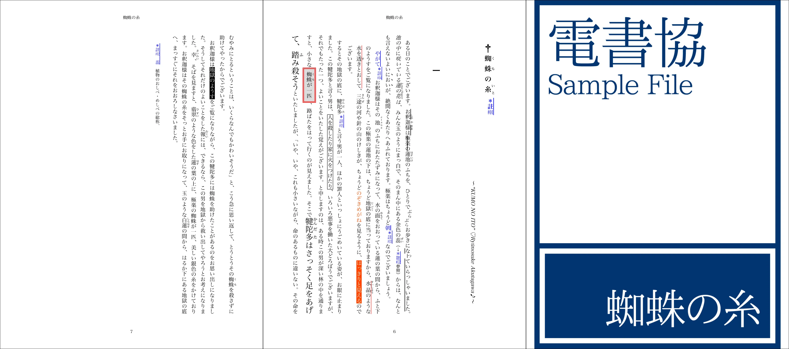

# EPUB3 (Japanese) 日本語EPUB用テーマ（電書協EPUB3制作ガイド準拠）

[](https://npmjs.com/package/@vivliostyle/theme-epub3j)
[](https://npmjs.com/package/@vivliostyle/theme-epub3j)


[電書協EPUB3制作ガイド](http://ebpaj.jp/counsel/guide)準拠のEPUBを作るためのテーマ
(Theme for EPUB compat with [EBPAJ EPUB 3 File Creation Guide](http://ebpaj.jp/counsel/guide))

## 電書協EPUB3制作ガイド付属のスタイルシートとサンプルの利用について

このテーマに含まれる以下のCSSファイルは、「電書協 EPUB 3 制作ガイド ver.1.1.3 2015年1月1日版」([ebpaj_epub3guide_ver1.1.3-150101.zip](http://ebpaj.jp/images/ebpaj_epub3guide_ver1.1.3-150101.zip))に付属するものです：

- ebpaj_epub3guide/book-style.css
- ebpaj_epub3guide/style-advance.css
- ebpaj_epub3guide/style-check.css
- ebpaj_epub3guide/style-reset.css
- ebpaj_epub3guide/style-standard.css

また、example ディレクトリ内のサンプル文書は、この制作ガイドに付属するサンプルEPUB（ebpaj-sample.epub）の内容を再利用して、XHTML文書からMarkdown原稿の形式に書き換えたものです。



## Use

In `vivliostyle.config.js`:

```js
module.exports = {
  theme: '@vivliostyle/theme-epub3j',
};
```
