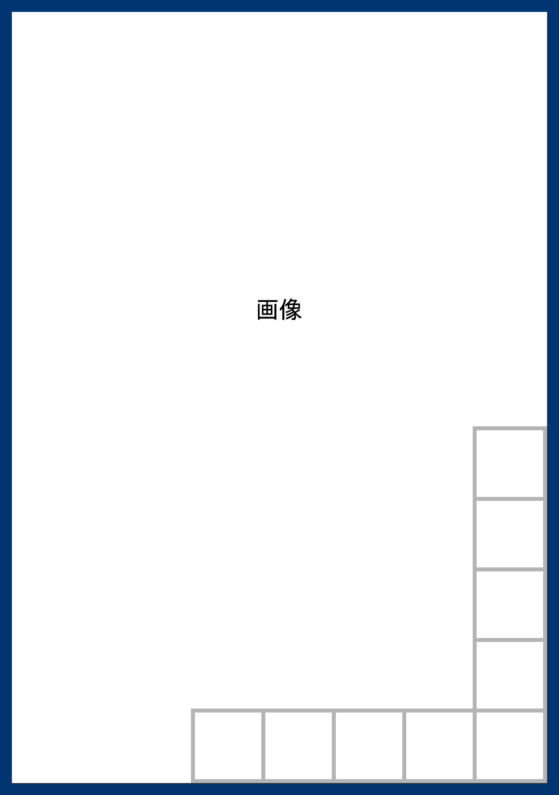

# 　 {蜘|く}{蛛|も}の{糸|いと}[＊註#01](p-cyushaku.html#note-001){.noteref #noteref-001}

{.font-1em30 #toc-002}

～“KUMO NO ITO” ♡Ryūnosuke Akutagawa♪～

 
 

## 　　　　一 {.gfont}

 

ある日のことでございます。お{釈|しや}<ruby><rt>か</rt>様<rt>さま</rt></ruby>は極楽の{蓮|はす}{池|いけ}のふちを、ひとりでぶらぶらお歩きになつていらっしゃいました。池の中に咲いている{蓮の花|Lotus Flower}は、みんな玉のようにまっ白で、そのまん中にある金色の{蕊|ずい}（→[＊註#02](#note-002){.noteref #noteref-002}参照）からは、なんとも言えないよいにおいが、絶間なくあたりへあふれております。極楽はちょうど[朝＊註#03](p-cyushaku.html#note-003){.noteref #noteref-003}なのでございましょう。

[やがて＊註#04](p-cyushaku.html#note-004){.noteref #noteref-004}お釈迦様はその<ruby>池<rt>éｔａｎｇ</rt></ruby>のふちにおたたずみになって、水の{面|おもて}をおおっている蓮の葉の間から、ふと下のようすをご覧になりました。この極楽の蓮池の下は、ちょうど{地|じ}{獄|ごく}の底に当っておりますから、{水|すい}{晶|しよう}のような水を{透|す}きとおして、{三|さん}{途|ず}の河や針の山のけしきが、ちょうどのぞきめがねを見るように、はっきりと見えるのでございます。

するとその地獄の底に、{犍|かん}{陀|だ}{多|た}[＊註#05](p-cyushaku.md#note-005){.noteref #noteref-005}と言う男が一人、ほかの罪人といっしょにうごめいている姿が、お眼に止まりました。この犍陀多と言う男は、人を殺したり家に火をつけたり、いろいろ悪事を働いた大どろぼうでございますが、それでもたった一つ、よいことをいたした覚えがございます。と申しますのは、ある時この男が深い林の中を通りますと、小さな{蜘|く}{蛛|も}が一匹、路ばたをはって行くのが見えました。そこで{犍|かん}{陀|だ}{多|た}はさっそく足をあげて、{踏|ふ}み殺そうといたしましたが、「いや、いや、これも小さいながら、命のあるものに違いない。その命をむやみにとるということは、いくらなんでもかわいそうだ」と、こう急に思い返して、とうとうその{蜘|く}{蛛|も}を殺さずに助けてやったからでございます。

お釈迦様は{地|じ}{獄|ごく}のようすをご覧になりながら、この犍陀多には蜘蛛を助けたことがあるのをお思い出しになりました。そうしてそれだけのよいことをした{報|むくい}には、できるなら、この男を地獄から救い出してやろうとお考えになりました。{幸|さいわい}、そばを見ますと、{翡|ひ}{翠|すい}のような色をした{蓮|はす}の葉の上に、極楽の蜘蛛が一匹、美しい銀色の糸をかけております。お釈迦様はその蜘蛛の糸をそっとお手にお取りになって、玉のような{白|しら}{蓮|はす}の間から、はるか下にある地獄の底へ、まっすぐにそれをおおろしなさいました。

 

[＊註#02　蕊](#noteref-002){.note #note-002}　植物のおしべ・めしべの総称。

 

 

 

## 　　　　二 {.gfont}

 

{こちらは地獄の底の血の池で、ほかの罪人といっしょに、浮いたり沈んだりしていた犍陀多でございます。|Lorem ipsum dolor sit amet, consectetur adipisicing elit, sed do eiusmod tempor incididunt ut labore et dolore magna aliqua. Ut enim ad minim veniam, quis nostrud exercitation ullamco laboris nisi ut aliquip ex ea commodo consequat.}なにしろどちらを見ても、まっ暗で、たまにそのくら{暗|やみ}からぼんやり浮き上がっているものがあると思いますと、それは恐しい針の山の針が光るのでございますから、その心細さと言ったらございません。その上あたりは墓の中のようにしんと静まり返って、たまに聞えるものといっては、ただ罪人がつくかすかな{嘆|たん}{息|そく}ばかりでございます。これはここへ落ちて来るほどの人間は、もうさまざまな地獄の{責|せめ}{苦|く}に{疲|つか}れはてて、泣声を出す力さえなくなっているのでございましょう。ですからさすが大どろぼうの犍陀多も、やはり血の池の血にむせびながら、まるで死にかかった{蛙|かわず}のように、ただもがいてばかりおりました>

ところがある時のことでございます。{何|なに}{気|げ}なく犍陀多が頭をあげて、血の池の空をながめますと、そのひっそりとした{暗|やみ}の中を、遠い遠い天上から、銀色の{蜘|く}{蛛|も}の糸が、まるで人目にかかるのを恐れるように、一すじ細く光りながら、するすると自分の上へたれて参るのではございませんか。犍陀多はこれを見ると、思わず手を{拍|う}って喜びました。この糸にすがりついて、どこまでものぼって行けば、きっと地獄からぬけ出せるのに{相|そう}{違|い}ございません。いや、うまく行くと、極楽へはいることさえもできましょう。そうすれば、もう針の山へ追い上げられることもなくなれば、血の池に沈められることもあるはずはございません。

こう思いましたから犍陀多は、さっそくその蜘蛛の糸を両手でしっかりとつかみながら、いっしょうけんめいに上へ上へとたぐりのぼり始めました。もとより大どろぼうのことでございますから、こういうことには昔から、慣れ切っているのでございます>

しかし地獄と極楽との{間|あいだ}は、何万里となくございますから、いくらあせってみたところで、容易に上へは出られません。ややしばらくのぼるうちに、とうとう犍陀多もくたびれて、もう一たぐりも上の方へはのぼれなくなってしまいました。そこでしかたがございませんから、まず一休み休むつもりで、糸の中途にぶらさがりながら、はるかに目の下を見おろしました。

すると、いっしょうけんめいにのぼった{甲|か}{斐|い}があって、さっきまで自分がいた血の池は、今ではもう暗の底にいつの間にかかくれております。それからあのぼんやり光っている恐しい針の山も、足の下になってしまいました。この分でのぼって行けば、{地|じ}{獄|ごく}からぬけ出すのも、存外わけがないかもしれません。犍陀多は両手を{蜘|く}{蛛|も}の糸にからみながら、ここへ来てから何年にも出したことのない声で、「しめた。しめた」と笑いました。ところがふと気がつきますと、蜘蛛の糸の下の方には、{数|かず}{限|かぎ}りもない罪人たちが、自分ののぼったあとをつけて、まるで{蟻|あり}の行列のように、やはり上へ上へ一心によじのぼって来るではございませんか。犍陀多はこれを見ると、{驚|おどろ}いたのと恐しいのとで、しばらくはただ、ばかのように大きな口をあいたまま、眼ばかり動かしておりました。自分一人でさえ、{断|き}れそうな、この細い蜘蛛の糸が、どうしてあれだけの人数の重みに{堪|た}えることができましょう。もし万一途中で{断|き}れたといたしましたら、せっかくここへまでのぼって来たこのかんじんな自分までも、もとの地獄へさか落しに落ちてしまわなければなりません。そんなことがあったら、大変でございます。が、そういううちにも、罪人たちは何百となく何千となく、まっ暗な血の池の底から、うようよとはい上がって、細く光っている蜘蛛の糸を、一列になりながら、せっせとのぼって参ります。今のうちにどうかしなければ、糸はまん中から二つに断れて、落ちてしまうのに違いありません。

そこで犍陀多は大きな声を出して、「こら、罪人ども。この蜘蛛の糸は{己|おれ}のものだぞ。お前たちはいったい誰に{尋|き}いて、のぼって来た。おりろ。おりろ」とわめきました>

そのとたんでございます。今までなんともなかった蜘蛛の糸が、急に犍陀多のぶらさがっている所から、ぷつりと音を立てて{断|き}れました。ですから犍陀多もたまりません。あっと言う間もなく風を切って、{独|こ}{楽|ま}のようにくるくるまわりながら、見る見るうちに{暗|やみ}の底へ、まっさかさまに落ちてしまいました。

あとにはただ極楽の蜘蛛の糸が、きらきらと細く光りながら、月も星もない空の中途に、短くたれているばかりでございます。

 

 

## 

 

お{釈|しや}{迦|か}{様|さま}は極楽の{蓮|はす}{池|いけ}のふちに立って、この一部始終をじっと見ていらっしゃいましたが、やがて{犍|かん}{陀|だ}{多|た}が[血の池＊註#06](p-cyushaku.html#note-006){.noteref #noteref-006}の底へ石のように沈んでしまいますと、悲しそうなお顔をなさりながら、またぶらぶらお歩きになり始めました。自分ばかり{地|じ}{獄|ごく}からぬけ出そうとする、犍陀多の{無|む}{慈|じ}{悲|ひ}な心が、そうしてその心相当な{罰|ばつ}をうけて、元の地獄へ落ちてしまったのが、お釈迦様のお目から見ると、あさましく{思|おぼ}し{召|め}されたのでございましょう>

しかし極楽の蓮池の蓮は、少しもそんなことにはとんじゃくいたしません。その玉のような白い花は、お釈迦様の{御|おみ}{足|あし}のまわりに、ゆらゆら{萼|うてな}[＊註#07](p-cyushaku.html#note-007){.noteref #noteref-007}を動かして、そのまん中にある金色の{蕊|ずい}からは、なんとも言えないよいにおいが、{絶|たえ}{間|ま}なくあたりへあふれております。極楽ももう{午|ひる}に近くなったのでございましょう。

 

（大正七年四月十六日）

 

　 ← 画像クリックまたはタップでページを再読み込み

