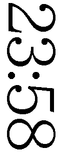
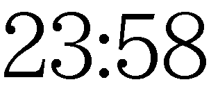

# 　註 {#toc-003 .font-1em30}

 

## 　　　　蜘蛛の糸

 

[＊註#01　蜘蛛の糸](p-002.html#noteref-001){.note #note-001}　ドストエフスキイ「カラマゾフ兄弟」第七{篇|へん}第三「一本の{葱|ねぎ}」に取材。

[＊註#03　朝](p-002.html#noteref-003){.note #note-003}　時刻はなど。　※行内縦長画像（幅１文字分に縮小）例

[＊註#04　やがて](p-002.html#noteref-004){.note #note-004}　時刻はなど。　※行内横長画像（高さ１文字分に縮小）例

[＊註#05　犍陀多](p-002.html#noteref-005){.note #note-005}　先ンズレバ{即|すなは}チ制スレ人ヲ　※訓点（返り点、送り仮名）例

[＊註#06　血の池](p-002.html#noteref-006){.note #note-006}　古池や　蛙飛ンだる　水の音　※小書き文字「ン」例

[＊註#07　萼](p-002.html#noteref-007){.note #note-007}　以下、三点リーダの連続…………………………………………………………………………………………………………以下２倍ダーシ（U+0215）連続――――――――――――――――――――――――――――――――――――――――以下罫線文字（U+2500）連続 ────────────────────────────────────────　※禁則例

