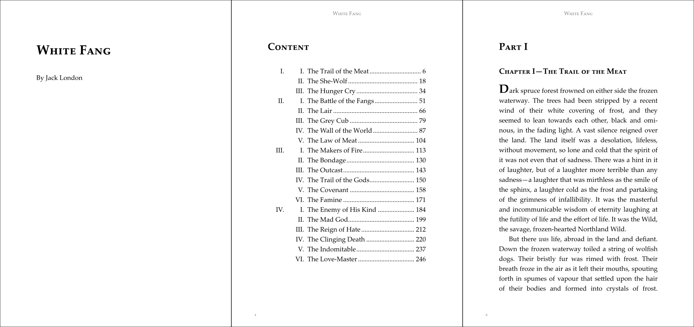
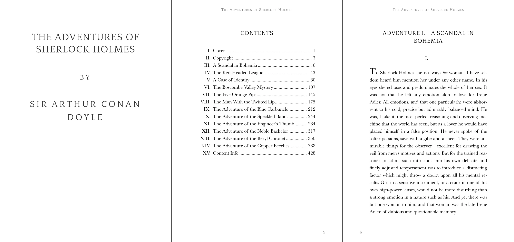

# Vivliostyle Theme Gutenberg

[](https://npmjs.com/package/@vivliostyle/theme-gutenberg)
[](https://npmjs.com/package/@vivliostyle/theme-gutenberg)


book theme for latin font

## Use

In `vivliostyle.config.js`:

```js
module.exports = {
  theme: 'vivliostyle-theme-gutenberg',
};
```

theme-gutenberg also provides some extra theme files derived from the basic theme.

#### [alice.css](alice.css)


```js
module.exports = {
  theme: {
    specifier: 'vivliostyle-theme-gutenberg',
    import: 'alice.css',
  },
};
```

#### [fang.css](fang.css)



```js
module.exports = {
  theme: {
    specifier: 'vivliostyle-theme-gutenberg',
    import: 'fang.css',
  },
};
```

#### [sherlock.css](sherlock.css)



```js
module.exports = {
  theme: {
    specifier: 'vivliostyle-theme-gutenberg',
    import: 'sherlock.css',
  },
};
```

## Available theme CSS variables

```css
:root {
  /**
   *  Styles for drop caps
   */
  --vs-theme--dropcap-font-size: 1.8em;
  --vs-theme--dropcap-font-weight: var(--vs-font-weight-bold);
  --vs-theme--dropcap-line-height: 1;
  --vs-theme--dropcap-text-indent: 0;
}
```

The running head and the page number use the page variables of the base theme: the publication title sits at the top center and the page number at the outer bottom corner.

```css
:root {
  --vs-page--mbox-top-center-content: env(pub-title);
  --vs-page--mbox-bottom-outside-content: counter(page);
  --vs-page--mbox-text-color: gray;
}
```

## License

CC0 1.0

> Original author: Vivliostyle project team
